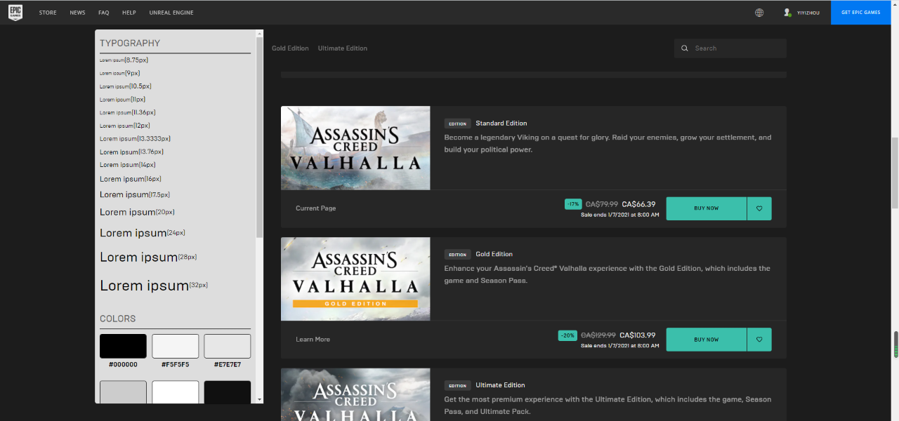
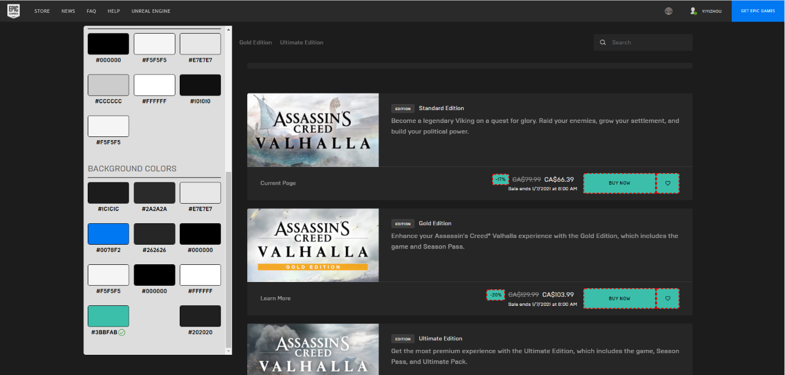
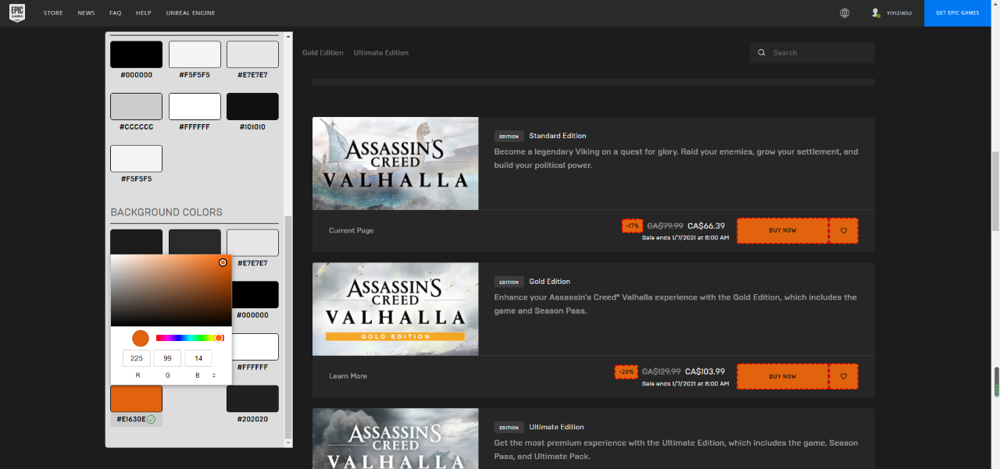
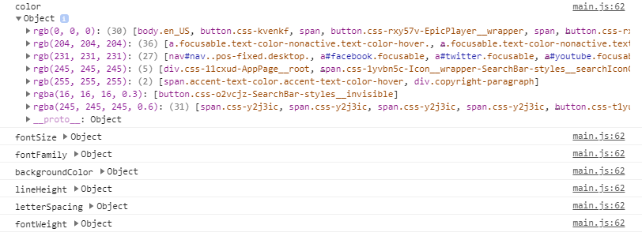

# style-inspect

An open source chrome extension developer tool
Link to store: https://chrome.google.com/webstore/detail/style-inspect/glkjdigblpcpjidkmadoeceklgmlalpb

Check all unique style been used in this page
Extract all unique style like font size, font color and background color that generate into a viewable style guide for user with just one click

No more digging into code or inspect elements to try to figure out what kind style guideline has been used in this page. 

Easier way to spot any unexpected color or font size been used in the page and have the ability to toggle corresponding element with highlight border

Ability to bulk update all elements that use the same color real time 

More unique style data available in the console for developer to use

Screenshot

